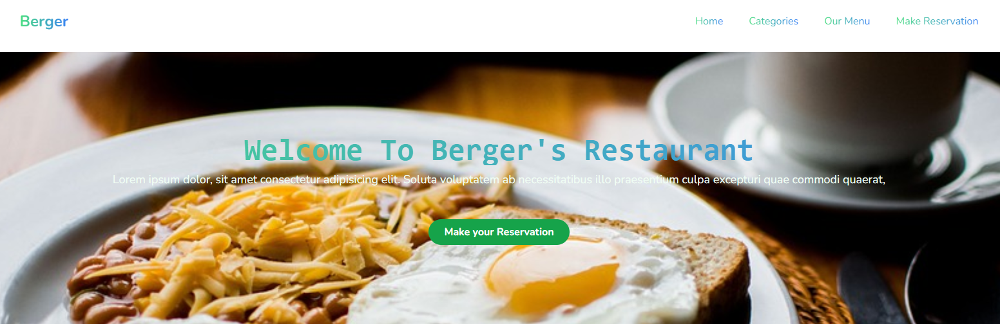
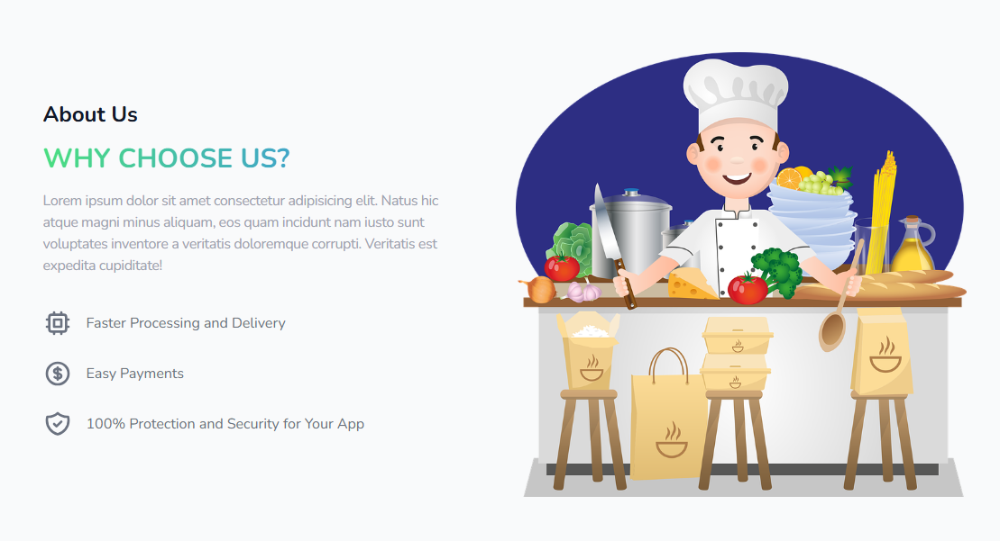
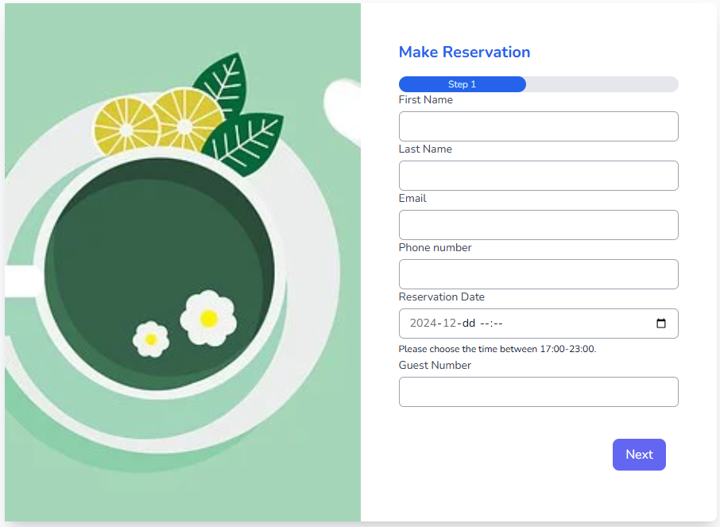
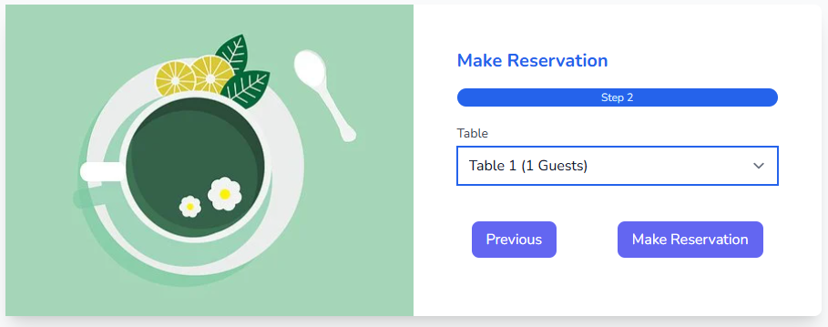

# Laravel Restaurant Project

<p align="center"><a href="https://laravel.com" target="_blank"></a></p>

Restaurant site made with laravel 9

To get a specials menu on front page, you need a 'Specials' category created in admin panel. Then uncomment section "Specials menu" in resources/views/welcome.blade.php

This is a Laravel-based web application for a restaurant that allows users to view the menu, check special menus, and make reservations for a table.

---

## Table of Contents
- [Features](#features)
- [Screenshots](#screenshots)
- [Installation](#installation)
  - [Prerequisites](#prerequisites)
  - [Steps to Install](#steps-to-install)
- [Usage](#usage)
- [Technologies Used](#technologies-used)
- [License](#license)

---

## Features

- **Menu**: View a list of all menu items offered by the restaurant.
- **Special Menus**: Display special menus that change periodically (e.g., daily or weekly specials).
- **Reservations**: Make a reservation for a table, including choosing the date, time, and number of people.

---

## Screenshots

Here are some screenshots of the project:

### Home Page



### Reservation Form



---

## Installation

### Prerequisites

- PHP >= 7.4
- Composer
- MySQL or MariaDB
- Laravel >= 8.x

### Steps to Install

1. **Clone the Repository**:
   ```bash
   git clone https://github.com/yourusername/restaurant-project.git
   ```

2. **Navigate to the Project Directory**:
   ```bash
   cd restaurant-project
   ```

3. **Install Dependencies**:
   Run the following command to install the project dependencies via Composer:
   ```bash
   composer install
   ```

4. **Set Up Environment File**:
   Copy the `.env.example` file to `.env` and set up the necessary environment variables:
   ```bash
   cp .env.example .env
   ```

5. **Generate Application Key**:
   Run the following command to generate the application key:
   ```bash
   php artisan key:generate
   ```

6. **Configure Database**:
   Update the `.env` file with your database credentials:
   ```plaintext
   DB_CONNECTION=mysql
   DB_HOST=127.0.0.1
   DB_PORT=3306
   DB_DATABASE=restaurant_db
   DB_USERNAME=root
   DB_PASSWORD=
   ```

7. **Run Migrations**:
   Run the migrations to set up the database schema:
   ```bash
   php artisan migrate
   ```

8. **Seed the Database** (optional):
   If you want to populate the database with sample data for menus and special menus, run the following:
   ```bash
   php artisan db:seed
   ```

9. **Serve the Application**:
   Start the Laravel development server:
   ```bash
   php artisan serve
   ```

   Now you can visit your application at `http://localhost:8000`.

---

## Usage

- **Menu Page**: View the list of all menu items.
- **Special Menus**: Check out daily or weekly specials.
- **Reservation**: Users can make a reservation by filling out a simple form with details such as the date, time, and number of people.

---

## Technologies Used

- Laravel 8
- MySQL/MariaDB
- Blade templating engine
- Bootstrap for UI styling

---

## License

This project is licensed under the MIT License - see the [LICENSE](LICENSE) file for details.
